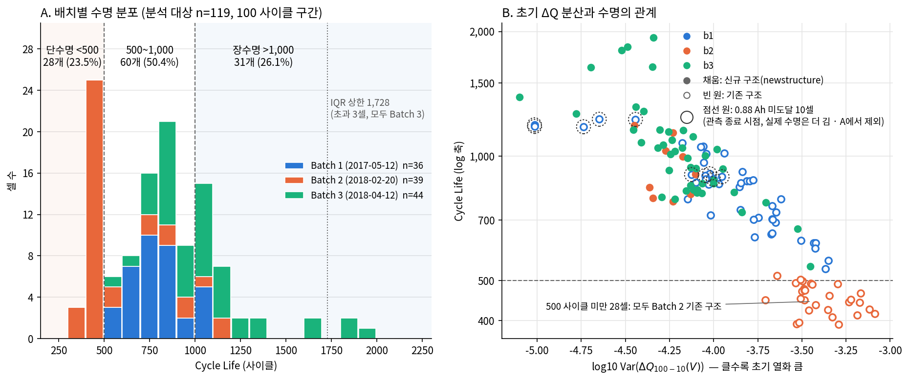
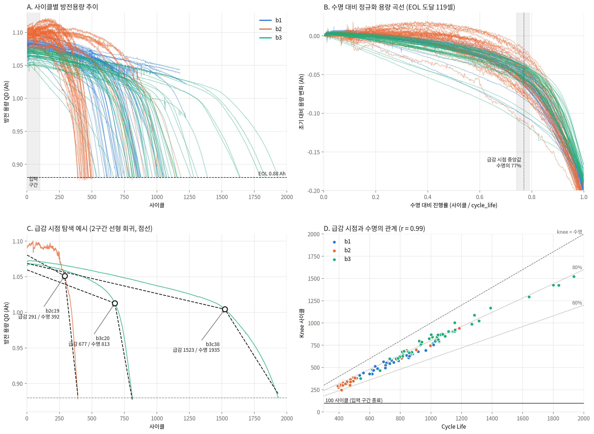
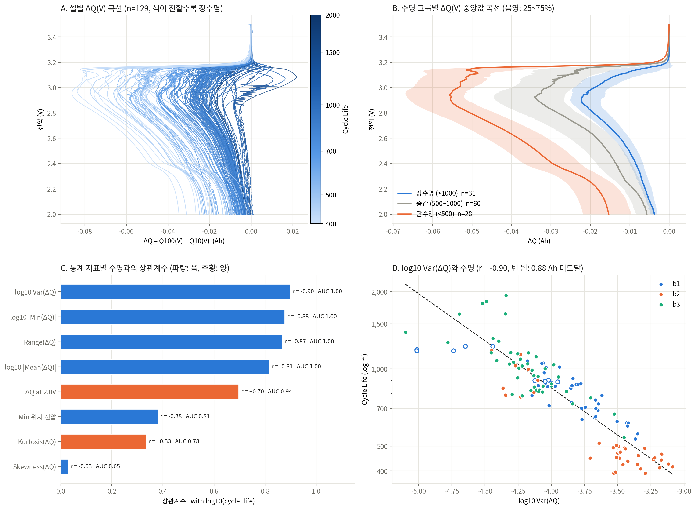
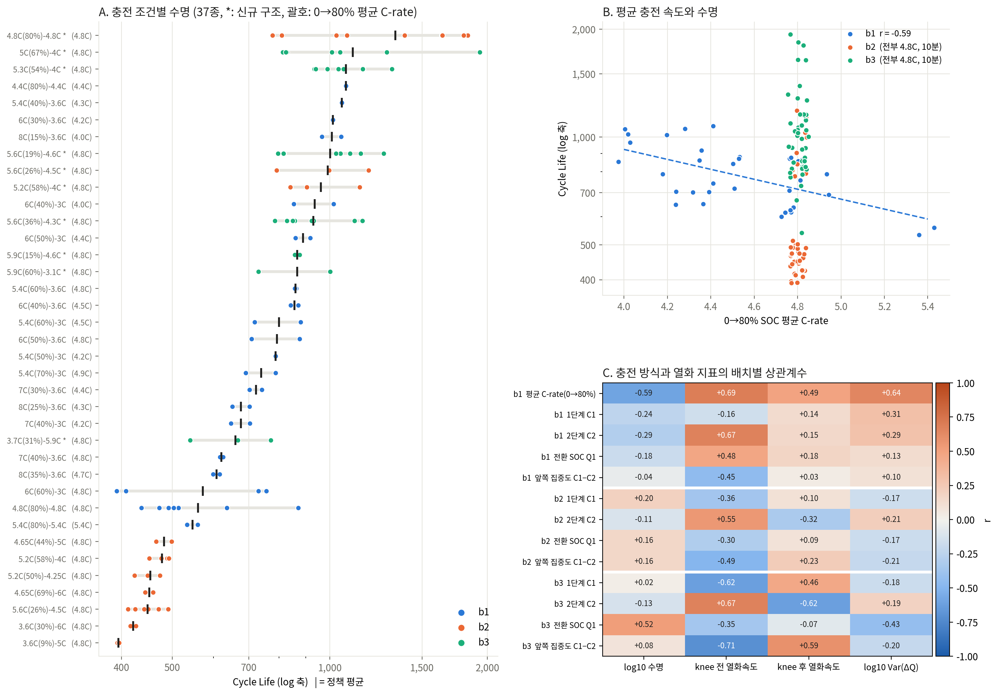
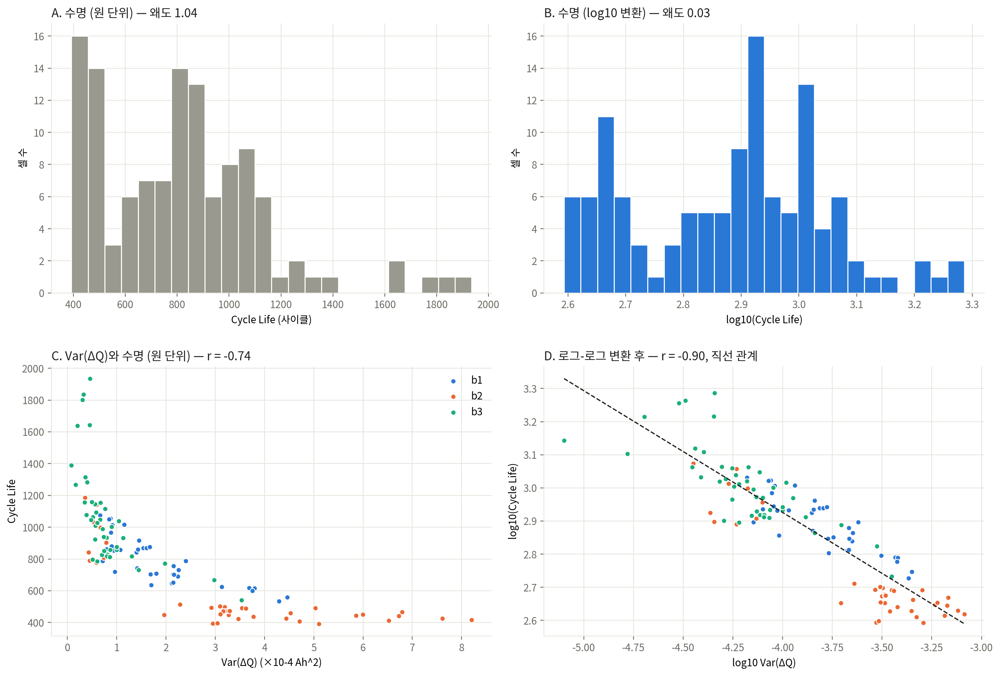
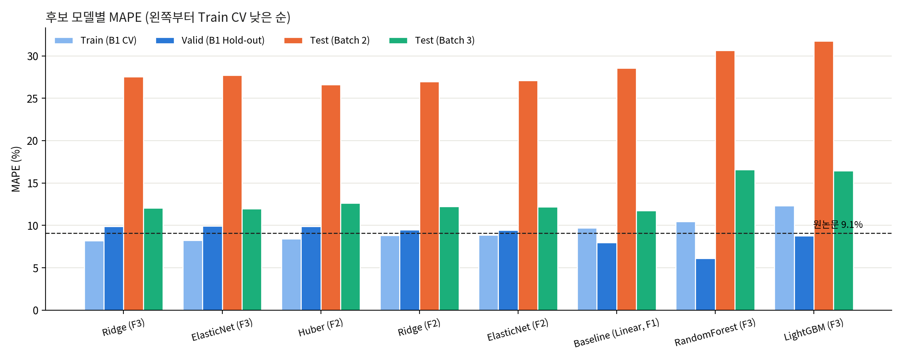
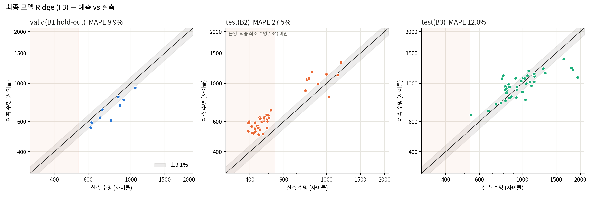

# ESS 배터리 수명 예측
#### 작성일: 2026년 10월 02일
#### 작성자: 울산캠퍼스 1반 U012 박세진

ESS(에너지저장시스템) 배터리의 운전 초기 100 사이클 데이터만으로 교체 시점(SOH 80%, 방전용량 0.88 Ah 도달 사이클)을 예측한다. 수명을 실측하려면 셀당 392\~1,935 사이클이 걸리므로, 초기 데이터로 수명을 미리 알아 교체·재고 계획을 세우고 단수명 셀을 조기에 선별하는 것이 목적이다.

## 프로젝트 개요
- 데이터셋 : MIT-Stanford Battery Dataset (Severson et al., Nature Energy 2019)
- 학습 데이터 : Batch 1 (2017-05-12) — 라벨을 신뢰할 수 있는 36셀
- 평가 데이터 : Batch 2 (2018-02-20) 39셀, 추가 평가 Batch 3 (2018-04-12) 40셀
- 태스크 : Regression (Cycle Life 예측), 목표변수 log10(cycle_life), 평가 지표 MAPE

## 파일 구조
```
├── data/
│   └── README.md               # 원본 .mat 다운로드·배치 방법
├── src/
│   ├── config.py               # 경로, RANDOM_SEED=42, 셀 제외 기준
│   ├── load_data.py            # .mat(HDF5) → 셀별 요약·방전 곡선
│   ├── features.py             # 전처리·피처 생성, 라벨 품질 플래그
│   ├── split.py                # Batch 1 충전 정책 단위 Hold-out 분할
│   ├── models.py               # 후보 모델·탐색 범위
│   ├── evaluate.py             # MAPE·RMSE·MAE, 구간별 MAPE
│   ├── train.py                # 학습·검증·평가 파이프라인
│   ├── make_report.py          # 성능 표·그림 생성
│   └── calibration.py          # [추가 분석] 신규 배치 소수 셀 보정
├── results/
│   └── model_performance.csv   # 후보 모델별 성능
├── outputs/                    # features.csv, predictions_final.csv, figures/
├── reports/performance.md      # 성능 보고 표
├── requirements.txt
└── README.md
```

## 환경 설정
```bash
git clone https://github.com/zinzin1011/ess-battery-life-prediction
cd ess-battery-life-prediction
pip install -r requirements.txt

python -m src.train --data-dir data/raw    # 학습·평가 (data/README.md 참고해 .mat 배치)
python -m src.make_report                  # 성능 표·그림
python -m src.calibration                  # (선택) 보정 시나리오
```
재현성: `RANDOM_SEED = 42`, 개발 환경 Python 3.10 / numpy 2.2 / pandas 2.3 / scikit-learn 1.7 / lightgbm 4.7 / h5py 3.16

## EDA

분석 대상은 전체 139셀 중 119셀이다. 수명 라벨이 없는 10셀(B2 8, B3 2)과, 0.88 Ah에 도달하지 않았는데 수명이 '마지막 기록 사이클 + 1'로 채워진 Batch 1 10셀을 제외했다.

- Cycle Life 분포
	- 392\~1,935 사이클의 오른쪽 꼬리 분포(왜도 1.04), 400\~500과 800\~1,000에 봉우리가 있는 이봉 분포
	- 단수명(<500) 28셀 23.5%, 중간(500\~1,000) 60셀 50.4%, 장수명(>1,000) 31셀 26.1% (분석 대상 119셀 기준). 배치별 중앙값은 B1 772, B2 472, B3 1,006
	- 핵심 발견 : 단수명 28셀이 전부 Batch 2이며, 평가 배치(B2) 39셀 중 30셀(77%)이 학습 배치(B1)의 최소 수명 534보다 짧다 → 학습 범위 밖 예측이 필요하다

	

- 열화 곡선 분석
	- 모든 셀이 '완만한 감소 → 급감' 형태. 급감 이후 용량 감소 속도는 단수명 위주인 B2가 132, B1 80, B3 68 mAh/100사이클로 단수명일수록 빠르다
	- Knee point는 모든 셀에 존재하며 중앙값 621 사이클, 수명의 약 77% 지점(셀 절반이 74\~79%). Knee 전후로 감소 속도가 약 11배(7.1 → 79.2 mAh/100사이클)
	- 핵심 발견 : 초기 100 사이클의 용량 변화는 중앙값 0.9 mAh(0.1%)에 불과하고 Knee는 전부 100 사이클 이후다 → 용량 값만으로는 수명을 가를 수 없고, Knee 관련 값은 누수라 입력으로 쓸 수 없다

	

- ΔQ(V) 곡선 분석
	- ΔQ = Q₁₀₀(V) − Q₁₀(V). 모든 셀에서 2.9 V 부근 용량이 줄어드는 골짜기 형태
	- 단수명 셀은 골이 깊고 넓으며(약 −0.055 Ah), 장수명 셀은 얕다(약 −0.02 Ah)
	- 핵심 발견 : log10 Var(ΔQ)와 log10 수명의 상관계수 −0.90, 배치별로도 −0.84 / −0.92 / −0.76으로 유지. 단수명·장수명을 겹침 없이 구분(AUC 1.00)

	

- 충전 속도(C-rate)와 수명의 관계
	- 충전 정책 37종. 수명 하위 5개 정책은 모두 B2 기존 구조 셀(395\~452), 최상위는 B3 4.8C 신규 구조(평균 1,564). 같은 정책도 배치에 따라 최대 3배 차이
	- B2·B3는 정책명이 달라도 SOC 0→80% 평균 충전 속도가 모두 4.8C(10분)로 같다
	- 핵심 발견 : 고속 충전일수록 수명이 짧은 경향은 Batch 1에서만 확인된다(r = −0.59). 전체로는 배치·셀 구조의 영향이 더 크다

	

- 분포 정규화와 다중공선성 (추가 확인)
	- 수명과 Var(ΔQ)에 log 변환 적용 시 왜도 1.04 → 0.03, 1.38 → −0.11, 두 변수의 상관 −0.74 → −0.90
	- 초기 변수 27개 중 21개가 VIF 10 초과. 초기 용량·내부저항·온도는 전체 상관은 있으나 배치 안에서는 0에 가까워 배치 차이만 반영
	- 핵심 발견 : 배치와 관계없이 수명과 일관된 관계를 보이는 것은 ΔQ 계열뿐이다

	

## Modeling

### 피처 엔지니어링 전략
선별 기준: 초기 100 사이클 안에서 계산 가능, Batch 1 안에서 log 수명과 상관 0.5 이상, 서로 상관 0.8 미만(또는 규제 모델에서만 병행)

| 구분 | 피처 | Batch 1 상관 | 근거 (EDA) |
| --- | --- | --- | --- |
| 핵심 | log10 Var(ΔQ) | −0.84 | 배치별로 일관된 최강 지표 |
| 보조 | log10 \|Min(ΔQ)\| | −0.82 | 골 깊이 정보, Var와 중복이 커 규제 모델에서 병행 |
| 보조 | ΔQ at 2.0 V | +0.68 | 저전압 구간 정보 |
| 보조 | SOC 0→80% 평균 충전 속도 | −0.59 | B1 충전 속도 효과, 평가 데이터 값(4.8C)이 학습 범위 안 |
| 제외 | 용량 기울기·변화량 | | B2는 초기 용량이 오히려 증가해 의미가 반대 |
| 제외 | 초기 용량·내부저항·온도 | | 배치 차이만 반영, 내부저항은 B2 6셀 측정 오류 |
| 제외 | Knee 관련 값 | | 수명 종료 후에야 알 수 있는 정보(누수) |

전처리: 사이클 1 제외(B1은 0으로 기록), 방전용량 급등락 보정, StandardScaler는 학습 데이터로만 fit

### 모델 선택 및 근거
- 후보 모델 : 단일 변수 선형 회귀(기준), ElasticNet, Ridge, Huber, RandomForest, LightGBM
- 최종 모델 : Ridge (피처 4개, alpha 0.001)
- 선택 이유 :
	- 평가 셀의 77%(30/39)가 학습 데이터의 수명 범위(534\~1,074)보다 짧다는 EDA 결과에 따라, 학습 범위 밖의 수명까지 예측해야 하는 모델링에는 직선 관계를 연장해 예측할 수 있는 선형 모델이 가장 적합하다고 판단했다.
	- log Var(ΔQ)와 log 수명이 직선 관계(r = −0.90)이므로 선형 모델로 관계를 그대로 표현할 수 있다.
	- ΔQ 계열 변수들이 서로 상관 0.92\~0.98로 겹치므로, 계수가 흔들리지 않도록 규제가 있는 Ridge를 선택했다.
	- 학습 데이터가 36셀로 적어, 추정할 계수가 변수 수(4개)만큼뿐인 단순한 모델이 안정적이다.
	- 트리 계열(RandomForest, LightGBM)은 학습 범위 밖의 값을 예측하지 못하는 구조라 적합하지 않다고 판단했다. Batch 1 검증 점수(RandomForest 6.11%)가 좋았던 것은 검증 셀이 학습 셀과 같은 수명 범위에 있었기 때문이다.
	- 위 판단은 Batch 1 교차검증 MAPE(Ridge 8.20%, 후보 중 최저)와 Batch 2 결과(선형 27.5%, 트리 30.7\~31.7%)로 확인했다.
- 검증 설계 : Batch 1을 충전 정책 단위로 Train 27 / Valid 9로 분할(같은 정책 셀이 양쪽에 들어가는 누수 방지), Train은 GroupKFold 5-fold. 최종 모델은 Batch 1 전체로 재학습 후 평가
- 설계 단계와 달라진 점 :
	- 설계서에서는 ElasticNet을 주 모델로 계획했으나, 교차검증 결과 Ridge(8.20%)와 ElasticNet(8.22%)이 사실상 같았고 두 모델 모두 규제 강도가 최소로 선택되었다. 입력변수를 미리 4개로 줄여 L1 규제로 더 걸러낼 변수가 없었기 때문이며, 같은 선형 계열이라 설계 방향(범위 밖 예측이 가능한 규제 선형 모델)은 유지된다
	- 설계서의 1차 목표(Batch 1 검증 MAPE 9.1% 이하)는 9.90%로 달성하지 못했다. 검증 셀이 9개라 1셀의 오차가 결과를 1%p 이상 움직일 수 있는 규모다
   
## 성능 결과

| 구분 |  | MAPE (%) | 비고 |
| --- | --- | --- | --- |
| Train (Batch 1 CV) |  | 8.20 |  |
| Valid (Batch 1 Hold-out) |  | 9.90 |  |
| Test (Batch 2) |  | 27.54 |  |
|  | Gap (Train-Valid) | +1.70 | (+) : 과적합 의심 |
|  | Gap (Valid-Test) | +17.64 | (+) : 배치간 일반화 저하 의심 |
|  | Gap (Target-Test) | +18.44 | Target : 원논문 9.1% |
| Test (Batch 3) |  | 12.05 |  |
|  | Gap (Batch2-Batch3) | −15.49 | Test 성능 간 비교 |
|  | Gap (Target-Test) | +2.95 | Batch 3 기준, 원논문 성능 비교 |

Gap = 뒤 항목 MAPE − 앞 항목 MAPE. 후보 모델 전체 비교는 `results/model_performance.csv`, 보조 지표(RMSE·MAE·구간별 MAPE)는 `reports/performance.md` 참고.




- 과적합은 작다(Train-Valid +1.70%p). 학습 배치 안에서는 원논문 수준(8\~10%)이 재현된다.
- Batch 2에서 오차가 크게 늘고(+17.64%p) Batch 3는 12.05%로 원논문 대비 +2.95%p다. Batch 2에 과적합된 것이 아니라 Batch 2만 수명 수준이 다르다.
- 지급된 Batch 2(2018-02-20)는 원논문의 평가 배치(2017-06-30)와 다른 파일이라 9.1%와의 직접 비교에는 한계가 있다.

### 시사점
- 논문과의 비교 : 학습 배치 안에서는 8\~10%로 원논문(9.1%) 수준이 재현되었고 Batch 3도 12.05%였다. Batch 2만 27.54%로 크게 벌어졌는데, 예측이 실제보다 일정하게 길게 나오는 치우침(예측/실측 중앙값 1.29배) 때문이다
- 오차의 원인은 학습 데이터의 양이 아니라 종류다 : Batch 2는 학습 범위(534 사이클 이상)보다 수명이 짧은 셀이 많고, 같은 ΔQ 분산에서도 수명이 약 24% 짧아 Batch 1에서 배운 관계가 그대로 적용되지 않는다. 학습 범위 안에 있는 셀도 19.6% 틀린 것이 그 근거다
- 모델과 변수를 바꿔도 해결되지 않는다 : 모델 종류를 바꾸거나 변수 조합 3,213개를 비교해도, Batch 1 내부 오차만 줄고 Batch 2 오차는 25% 안팎에 머물렀다. RandomForest는 Batch 1 검증에서 6.11%로 가장 좋았지만 학습 범위 밖을 예측하지 못해 Batch 2에서는 30.66%로 선형 모델보다 나빴다. 학습 배치 안의 점수만으로 모델을 고르면 안 된다
- 새 로트에는 실측 보정 절차가 필요하다 : 배치 간 차이는 초기 100 사이클 데이터만으로는 알 수 없으므로, 일부 셀을 수명 끝까지 시험해 예측값을 보정한 뒤 적용해야 한다. Batch 2 셀 5개로 보정하면 오차가 8.8%로 줄었다. 다만 Batch 2 정답을 사용한 값이므로 Test 성능으로 보고하지 않는다
- 보정은 치우침을 확인한 뒤에 한다 : 예측이 한쪽으로 치우치지 않은 Batch 3는 같은 보정을 하면 오히려 오차가 늘었다(12.1% → 13.7%)
  
## 오류 분석
- 모델이 가장 크게 틀린 셀의 공통점
	- Batch 2 : 오차 상위 8셀 중 7셀이 수명 393\~452의 기존 구조 셀이며 모두 38\~51% 과대 예측. 전체로도 39셀 중 95%가 과대 예측(예측/실측 중앙값 1.29)
	- 기존 구조 30셀 MAPE 29.9%, 신규 구조 9셀 19.6% — 학습 범위 안의 셀도 과대 예측되므로 범위 밖 예측만의 문제가 아니다
	- Batch 3 : 1,500 사이클을 넘는 장수명 4셀이 평균 32% 과소 예측(나머지 36셀은 9.9%)
- 원인 가설 및 개선 방향
	- 가설 1 — 배치 간 수명 수준 차이: 같은 ΔQ 분산에서도 Batch 2는 수명이 짧다(Batch 1 회귀선 대비 중앙값 −24%). 초기 100 사이클 동안 용량이 오히려 증가하는 등 열화 양상이 Batch 1과 다르다
	- 가설 2 — 학습 범위 한계: 학습 데이터 수명이 534\~1,074라 그 밖(짧은 쪽·긴 쪽 모두)에서 직선 연장의 오차가 커진다
	- 개선 1 — 신규 배치 소수 셀 실측 보정: Batch 2에서 5셀의 실측 수명으로 편향을 보정하면 MAPE 27.5% → 8.8%(무작위 200회 평균, `src/calibration.py`). 편향이 없는 Batch 3에서는 효과가 없어(12.1% → 13.7%) 편향 확인 후 적용해야 한다
	- 개선 2 — 단수명·장수명 셀과 신규 구조 셀을 학습 데이터에 추가해 수명 범위 확대
	- 개선 3 — ΔQ 기준 사이클(5·10·20) 민감도 확인 결과 Batch 2 오차는 27.5\~31.1%로 크게 달라지지 않아, 기준 사이클 문제가 아님을 확인

## ESS 도메인 해석

- 이 모델을 실제 BESS에 적용한다면 어떤 의사결정에 활용 가능한가?
	- 교체·재고 계획 : 운전 100 사이클 시점에 셀별 예상 교체 시점을 산출해 교체 일정과 예비 셀 재고를 로트 단위로 계획
	- 단수명 셀 조기 선별 : ΔQ 분산이 큰 셀을 우선 점검·교체 대상으로 지정해 보증·안전 리스크 관리
	- 충전 정책 결정 : Batch 1 기준 평균 충전 속도 4.5C 이상 셀의 수명이 약 15% 짧으므로(724 vs 852), 급속 충전 비율을 수명 감소 비용과 함께 검토
- 어떤 한계가 있으며, 실 배포를 위해 추가로 필요한 것은 무엇인가?
	- 한계 : 학습 데이터가 한 배치 36셀, 실험실 조건의 단일 셀 데이터다. 배치(로트)가 바뀌면 오차가 8\~10%에서 최대 27%까지 커진다
	- 필요 1 — 입력 분포 점검 : 신규 로트의 ΔQ 분산이 학습 범위를 벗어나는지 확인(B2 17/39셀이 범위 밖)
	- 필요 2 — 로트별 보정·재학습 : 신규 로트 일부 셀의 실측 수명으로 편향을 확인하고, 로트·셀 구조·충전 조건이 바뀌면 재학습
	- 필요 3 — 예측 오차 추적 : EOL 도달 셀의 오차를 누적 관리해 성능 저하 시 재학습
	- 필요 4 — 실운전 데이터 검증 : 실제 BESS의 부분 충방전·온도 변동 조건에서 ΔQ 지표가 유효한지 시범 운영으로 확인

## 참고문헌
- Severson et al. (2019). Data-driven prediction of battery cycle life before capacity degradation. *Nature Energy*, 4, 383–391.

## 팀 구성

* 박세진 : EDA, 피처 엔지니어링, 모델 개발, 성능 평가(Batch 2·Batch 3)
